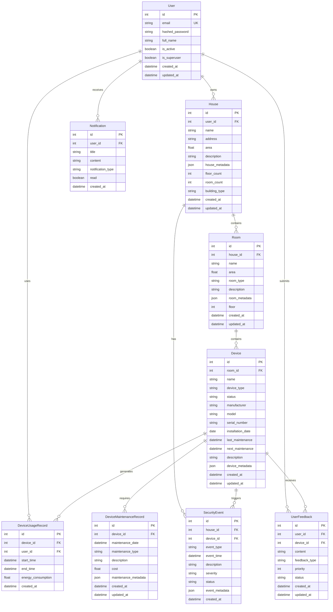

# 智能家居系统详细设计文档

## 一、数据库设计

### 1.1 实体关系说明

#### 1.1.1 ER图


#### 1.1.2 实体关系表
| 实体1 | 关系类型 | 实体2 | 关系描述 |
|-------|----------|-------|----------|
| User | 1:N | House | 一个用户可以拥有多个房屋 |
| User | 1:N | UserFeedback | 一个用户可以提交多个反馈 |
| User | 1:N | DeviceUsageRecord | 一个用户可以有多个设备使用记录 |
| User | 1:N | Notification | 一个用户可以接收多个通知 |
| House | 1:N | Room | 一个房屋包含多个房间 |
| House | 1:N | SecurityEvent | 一个房屋可以发生多个安全事件 |
| Room | 1:N | Device | 一个房间包含多个设备 |
| Device | 1:N | DeviceUsageRecord | 一个设备有多条使用记录 |
| Device | 1:N | DeviceMaintenanceRecord | 一个设备有多条维护记录 |
| Device | 1:N | SecurityEvent | 一个设备可以触发多个安全事件 |
| Device | 1:N | UserFeedback | 一个设备可以收到多个用户反馈 |

#### 1.1.2 实体属性表

**User（用户）**
| 字段名 | 类型 | 说明 | 约束 |
|--------|------|------|------|
| id | int | 主键 | PK |
| email | string | 邮箱 | UNIQUE, NOT NULL |
| hashed_password | string | 密码哈希 | NOT NULL |
| full_name | string | 全名 | |
| is_active | boolean | 是否激活 | DEFAULT TRUE |
| is_superuser | boolean | 是否超级用户 | DEFAULT FALSE |
| created_at | datetime | 创建时间 | DEFAULT CURRENT_TIMESTAMP |
| updated_at | datetime | 更新时间 | DEFAULT CURRENT_TIMESTAMP |

**House（房屋）**
| 字段名 | 类型 | 说明 | 约束 |
|--------|------|------|------|
| id | int | 主键 | PK |
| user_id | int | 用户ID | FK |
| name | string | 房屋名称 | NOT NULL |
| address | string | 地址 | NOT NULL |
| area | float | 面积 | NOT NULL |
| description | string | 描述 | |
| house_metadata | json | 元数据 | |
| floor_count | int | 楼层数 | |
| room_count | int | 房间数 | |
| building_type | string | 建筑类型 | |
| created_at | datetime | 创建时间 | DEFAULT CURRENT_TIMESTAMP |
| updated_at | datetime | 更新时间 | DEFAULT CURRENT_TIMESTAMP |

**Room（房间）**
| 字段名 | 类型 | 说明 | 约束 |
|--------|------|------|------|
| id | int | 主键 | PK |
| house_id | int | 房屋ID | FK |
| name | string | 房间名称 | NOT NULL |
| area | float | 面积 | NOT NULL |
| room_type | string | 房间类型 | NOT NULL |
| description | string | 描述 | |
| room_metadata | json | 元数据 | |
| floor | int | 所在楼层 | DEFAULT 1 |
| created_at | datetime | 创建时间 | DEFAULT CURRENT_TIMESTAMP |
| updated_at | datetime | 更新时间 | DEFAULT CURRENT_TIMESTAMP |

**Device（设备）**
| 字段名 | 类型 | 说明 | 约束 |
|--------|------|------|------|
| id | int | 主键 | PK |
| room_id | int | 房间ID | FK |
| name | string | 设备名称 | NOT NULL |
| device_type | string | 设备类型 | NOT NULL |
| status | string | 状态 | NOT NULL |
| manufacturer | string | 制造商 | |
| model | string | 型号 | |
| serial_number | string | 序列号 | |
| installation_date | date | 安装日期 | |
| last_maintenance | datetime | 上次维护时间 | |
| next_maintenance | datetime | 下次维护时间 | |
| description | string | 描述 | |
| device_metadata | json | 元数据 | |
| created_at | datetime | 创建时间 | DEFAULT CURRENT_TIMESTAMP |
| updated_at | datetime | 更新时间 | DEFAULT CURRENT_TIMESTAMP |

**DeviceUsageRecord（设备使用记录）**
| 字段名 | 类型 | 说明 | 约束 |
|--------|------|------|------|
| id | int | 主键 | PK |
| device_id | int | 设备ID | FK |
| user_id | int | 用户ID | FK |
| start_time | datetime | 开始时间 | NOT NULL |
| end_time | datetime | 结束时间 | |
| energy_consumption | float | 能源消耗 | |
| created_at | datetime | 创建时间 | DEFAULT CURRENT_TIMESTAMP |

**DeviceMaintenanceRecord（设备维护记录）**
| 字段名 | 类型 | 说明 | 约束 |
|--------|------|------|------|
| id | int | 主键 | PK |
| device_id | int | 设备ID | FK |
| maintenance_date | datetime | 维护日期 | NOT NULL |
| maintenance_type | string | 维护类型 | NOT NULL |
| description | string | 描述 | |
| cost | float | 费用 | |
| maintenance_metadata | json | 元数据 | |
| created_at | datetime | 创建时间 | DEFAULT CURRENT_TIMESTAMP |
| updated_at | datetime | 更新时间 | DEFAULT CURRENT_TIMESTAMP |

**SecurityEvent（安全事件）**
| 字段名 | 类型 | 说明 | 约束 |
|--------|------|------|------|
| id | int | 主键 | PK |
| house_id | int | 房屋ID | FK |
| device_id | int | 设备ID | FK |
| event_type | string | 事件类型 | NOT NULL |
| event_time | datetime | 事件时间 | NOT NULL |
| description | string | 描述 | |
| severity | string | 严重程度 | |
| status | string | 状态 | |
| event_metadata | json | 元数据 | |
| created_at | datetime | 创建时间 | DEFAULT CURRENT_TIMESTAMP |

**UserFeedback（用户反馈）**
| 字段名 | 类型 | 说明 | 约束 |
|--------|------|------|------|
| id | int | 主键 | PK |
| user_id | int | 用户ID | FK |
| device_id | int | 设备ID | FK |
| content | string | 内容 | NOT NULL |
| feedback_type | string | 反馈类型 | NOT NULL |
| priority | int | 优先级 | DEFAULT 0 |
| status | string | 状态 | NOT NULL |
| created_at | datetime | 创建时间 | DEFAULT CURRENT_TIMESTAMP |
| updated_at | datetime | 更新时间 | DEFAULT CURRENT_TIMESTAMP |

**Notification（通知）**
| 字段名 | 类型 | 说明 | 约束 |
|--------|------|------|------|
| id | int | 主键 | PK |
| user_id | int | 用户ID | FK |
| title | string | 标题 | |
| content | string | 内容 | |
| notification_type | string | 通知类型 | |
| read | boolean | 是否已读 | |
| created_at | datetime | 创建时间 | |

## 二、API接口设计

### 2.1 认证相关接口

#### 2.1.1 用户注册
```http
POST /api/v1/auth/register
```
- **功能**：注册新用户
- **请求体**：
  ```json
  {
    "email": "string",
    "password": "string",
    "full_name": "string",
    "phone_number": "string",
    "preferences": {}
  }
  ```
- **安全设计**：
  - 密码使用bcrypt进行哈希处理
  - 邮箱唯一性验证
  - 密码强度验证

#### 2.1.2 用户登录
```http
POST /api/v1/auth/login
```
- **功能**：用户登录获取访问令牌
- **请求体**：
  ```json
  {
    "username": "string",  // 邮箱
    "password": "string"
  }
  ```
- **安全设计**：
  - JWT令牌认证
  - 令牌过期机制
  - 密码验证使用bcrypt

### 2.2 用户管理接口

#### 2.2.1 获取当前用户信息
```http
GET /api/v1/users/me
```
- **功能**：获取当前登录用户的详细信息
- **认证**：需要JWT令牌
- **响应**：用户详细信息

#### 2.2.2 更新用户信息
```http
PUT /api/v1/users/me
```
- **功能**：更新当前用户的信息
- **认证**：需要JWT令牌
- **请求体**：可更新的用户信息字段

### 2.3 房屋管理接口

#### 2.3.1 获取房屋列表
```http
GET /api/v1/houses
```
- **功能**：获取当前用户的所有房屋
- **认证**：需要JWT令牌
- **查询参数**：
  - skip：跳过记录数
  - limit：返回记录数

#### 2.3.2 获取房屋详情
```http
GET /api/v1/houses/{house_id}
```
- **功能**：获取特定房屋的详细信息
- **认证**：需要JWT令牌
- **权限**：验证房屋所有权

### 2.4 房间管理接口

#### 2.4.1 获取房间列表
```http
GET /api/v1/rooms
```
- **功能**：获取当前用户所有房屋的房间列表
- **认证**：需要JWT令牌
- **查询参数**：
  - skip：跳过记录数
  - limit：返回记录数

### 2.5 设备管理接口

#### 2.5.1 获取设备列表
```http
GET /api/v1/devices
```
- **功能**：获取设备列表
- **认证**：需要JWT令牌
- **查询参数**：
  - skip：跳过记录数
  - limit：返回记录数

### 2.6 安全事件接口

#### 2.6.1 创建安全事件
```http
POST /api/v1/security
```
- **功能**：记录新的安全事件
- **请求体**：
  ```json
  {
    "event_type": "string",
    "description": "string",
    "severity": "string",
    "device_id": "integer"
  }
  ```

#### 2.6.2 获取安全事件列表
```http
GET /api/v1/security
```
- **功能**：获取安全事件列表
- **查询参数**：
  - house_id：房屋ID
  - device_id：设备ID
  - event_type：事件类型
  - severity：严重程度
  - status：状态
  - start_time：开始时间
  - end_time：结束时间

### 2.7 用户反馈接口

#### 2.7.1 创建反馈
```http
POST /api/v1/feedback
```
- **功能**：创建新的用户反馈
- **认证**：需要JWT令牌
- **请求体**：
  ```json
  {
    "content": "string",
    "feedback_type": "string",
    "priority": "integer"
  }
  ```

#### 2.7.2 获取反馈列表
```http
GET /api/v1/feedback
```